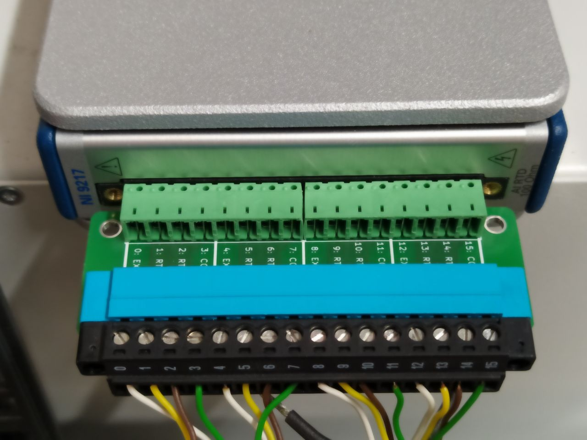
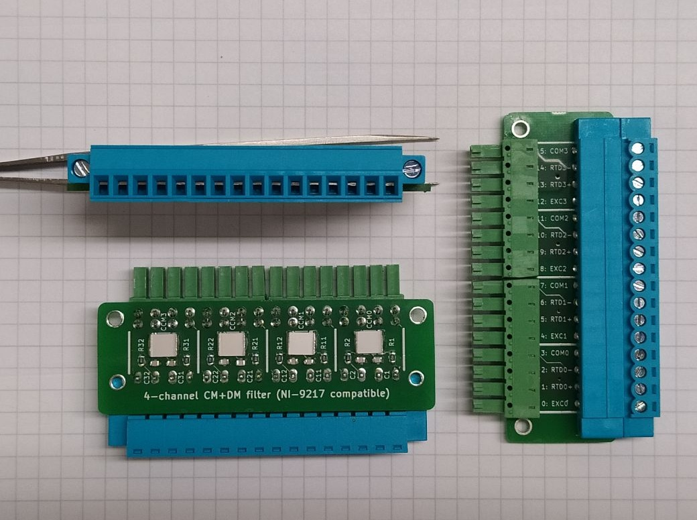
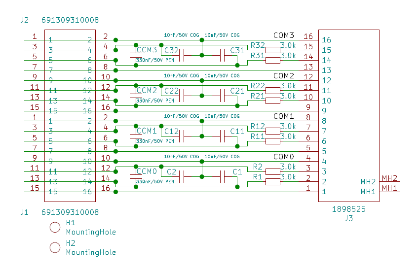
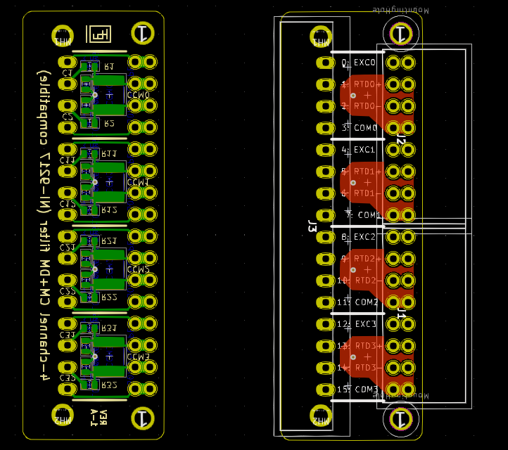

# Filter-9217

A pluggable input filter adapter to mitigate CM and DM noise on 4-wire RTD scanner modules like NI-9217.

## Schematic

## Board

## Connectors

For part names and mating connector see 
[Filter-9217-1A_sch.pdf](Filter-9217-1A/Filter-9217-1A_sch.pdf).

## Revisions

- 2021-03-09: Rev-1A released with corrected silk screen orientation (was upside-down when module mounted horizontally)